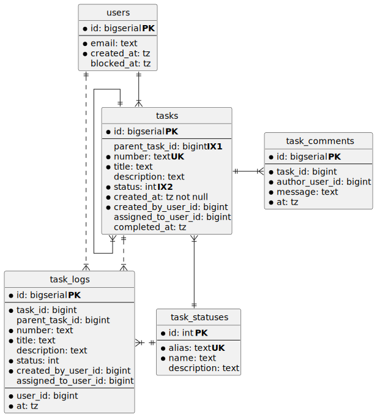

## Описание базы данных
База данных используется для сервиса управления задачами. Задачи имеют иерархическую стрyктуру без ограничений уровней вложенности, т.е. у задания может быть не более одного родительского задания.
Задания создаются пользователями в статусе "Черновик" (Draft) и характеризуются уникальным Номером, а также Заголовком и Описанием.
После того, как автор задания готов передать его в работу, оно переходит в статус "Готово к работе" (ToDo) и ожидает, пока какой-либо пользователь возьмет его в работу.
Когда исполнитель берет задание в работу, оно переходит в статус "В работе" (InProgress) и находится там до завершения работы. После чего переходит в статус "Выполнено" (Done).
В любой момент времени задание может быть безвозвратно отменено - в этом случае оно перейдет в статус "Отменено" (Canceled). Все изменения задания логируются.
С момента перехода задания в статус "В работе" исполнитель и автор могут по заданию оставлять комментарии.

### Сущности
- **users** - справочник пользователей
  - id - уникальный идентификатор пользователя
  - email - адрес эл.почты пользователя
  - created_at - метка времени регистрации пользователя
  - blocked_at - метка времени, после которой пользователь будет считаться заблокированным
- **tasks** - задания и подзадания
  - id - идентификатор задания/подзадания
  - parent_task_id - идентификатор родительского задания (заполнено только для подзаданий)
  - number - номер задания/подзадания. Формат номера: **YYYYMMDD-N**, где **YYYY** - год, **MM** - месяц, **DD** - день, **N** - порядковый номер задания за день. Например, второе задание за 28.08.2023 будет иметь номер _20230823-2_.
  - title - заголовок задания
  - description - описание задания
  - status - статус задания
  - created_by_user_id - идентификатор пользователя, который создал задание
  - assigned_to_user_id - идентификатор пользователя, который сейчас является исполнителем задания
  - created_at - метка времени создания задания
  - completed_at - метка времени, когда задание было завершено
- **task_logs** - лог изменения задания/подзадания, в ней фиксируются изменения любых полей
  - id - идентификатор записи лога
  - ... поля те же, что в таблице tasks
  - user_id - идентификатор пользователя, выполнившего изменения данных
  - at - метка времени, когда были внесены изменения
- **task_comments** - комментарии по задаче/подзадаче
  - id - идентификатор комментария
  - task_id - идентификатор задачи/подзадачи
  - author_user_id - идентификатор пользователя, который оставил комментарий
  - message - сообщение
  - at - метка времени, когда комментарий был добавлен
- **task_statuses** - справочник статусов
  - id - идентификатор статуса
  - alias - псевдоним статуса (например, как ключ enum'а)
  - name - название статуса (на русском)
  - description - описание статуса

### Схема БД

